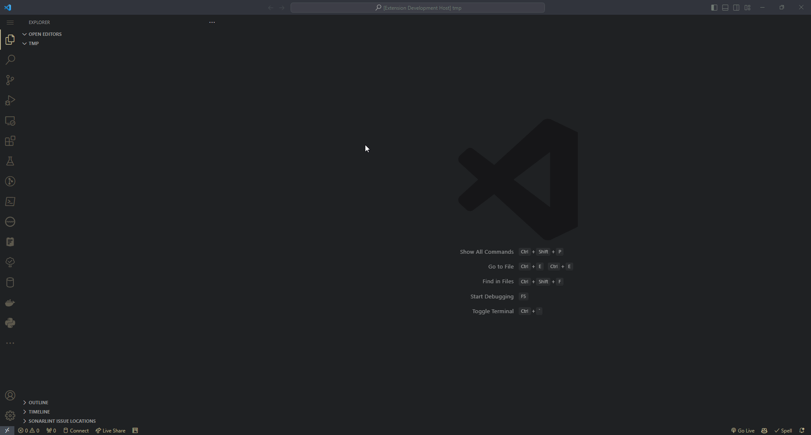
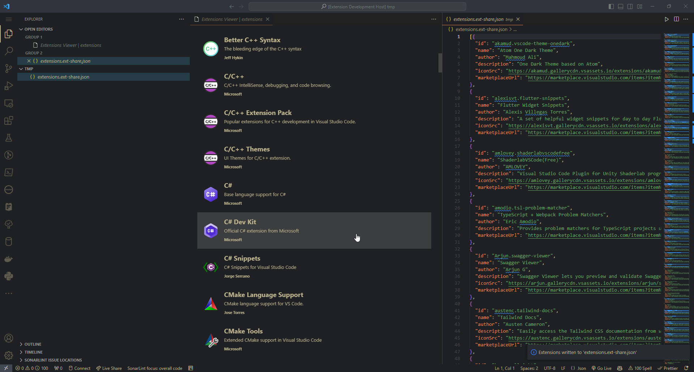
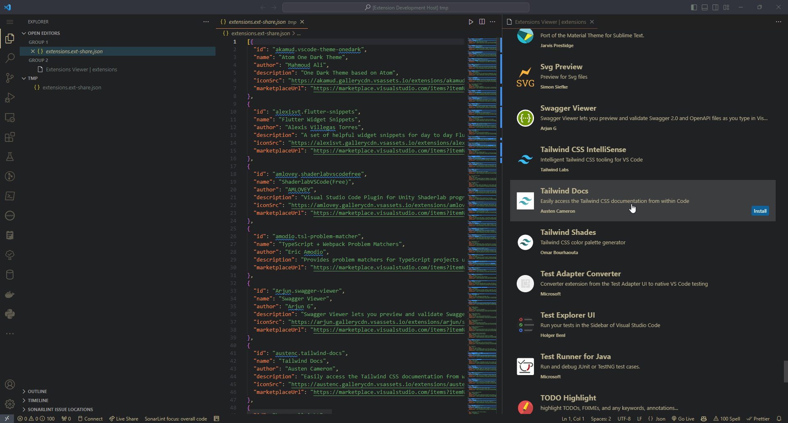
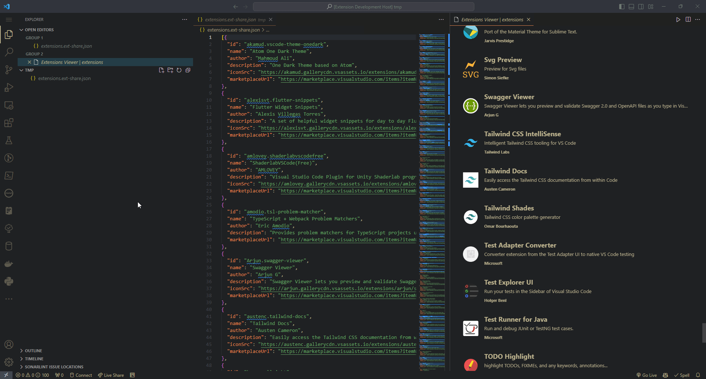

# ExtShare | ext-share

Export your currently installed vscode extensions to a shareable JSON file and use the provided *Extension Viewer* to view & install extensions present in the JSON file.

## Features

ExtShare allows you to share your vscode extensions with your friends and colleagues via a JSON file export:

When any `.ext-share.json` file is opened, the *Extension Viewer* will automatically open (and close) with it.

It allows you to browse listed extensions in the file in a similar manner as the vscode Extensions page:

You can also install the extensions from the *Extension Viewer*:

Clicking on an extension will open the extension's Extension page in vscode:

  
## Commands

* `ExtShare: Export Extensions` - Export your currently installed extensions to a `extensions.share-ext.json` file in the current workspace.
* `ExtShare: Open Extension Viewer` - Open the Extension Viewer for the current `.ext-share.json` file.
  * This command is automatically run when any `.ext-share.json` file is opened.

## Release Notes

### 1.0.0

- Initial release
- `.ext-share.json` file format
- JSON export
- Extension Viewer
- Synchronized opening/closing of Extension Viewer with `.ext-share.json` file
- Rerendering of Extension Viewer when `.ext-share.json` file or currently installed extensions change
- Installing extensions from Extension Viewer
- Opening extension's Extension page in vscode from Extension Viewer